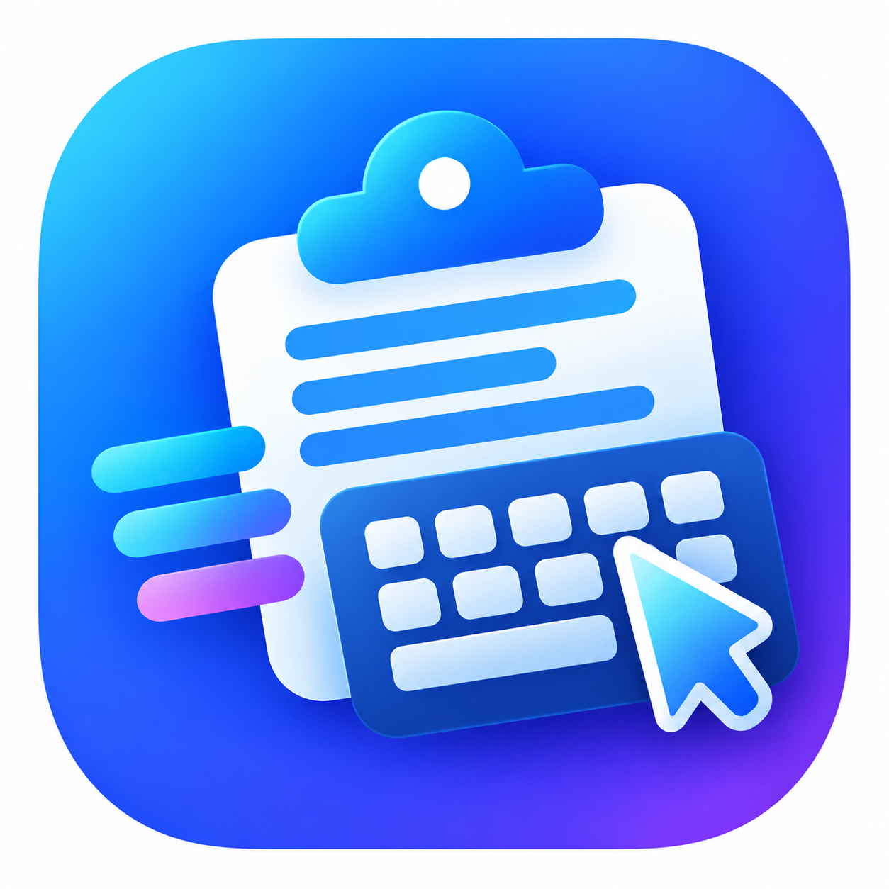

<p align="center">
  
</p>

# 📋 ClipType

> **专业的原生击键模拟剪贴板注入工具**  
> *在无法使用 `Ctrl+V` 的环境下，模拟真实键盘敲击完成文本粘贴。*

  

---

## 📥 下载与使用

**不想折腾源码？**  
您可以直接从 Releases 页面下载适合您系统的即用版本：

[**👉 前往下载最新发行版**](https://github.com/CarMan5012/ClipType/releases/latest)

---

## 🚀 为什么需要 ClipType？

在很多场景下，传统的 `Ctrl+V` 会完全失效——例如在**远程桌面（RDP）**、**VNC 虚拟机控制台**、**受限制的密码输入框**，或者是古老的**无剪贴板终端**中。

**ClipType 通过模拟真实的物理按键，逐字将剪贴板内容“键入”目标窗口，就像您在键盘上亲手敲击一样。**

### ✨ 核心特性

* **🤖 防自动化检测（全平台）：**
  * **随机输入延迟：** 在每个字符之间加入随机毫秒级延迟，完美模拟人类自然打字节奏，轻松应对严格的输入检测机制。
  * **智能标点停顿：** 遇到标点符号（如 `.`, `,`, `?`, `!`, `:`）时自动加入符合人类思考习惯的微停顿。
* **🛡️ 敏感数据擦除：** 保护隐私数据！开启后可在模拟输入完成的瞬间，立即从系统内存中清空剪贴板内容。
* **🎨 代码与格式保护：** 完美保留复杂的代码缩进与空格（例如 Python 代码），自动规范化处理 CRLF 与 LF 换行符，并支持智能修剪首尾多余空白。
* **🛑 智能安全中断（Windows）：**
  * **紧急中止键：** 输入过程中随时按下 **`Esc`** 键即可立即停止输入。
  * **焦点丢失保护：** 目标窗口一旦失去焦点即刻自动停止，杜绝将敏感内容误输入到聊天软件或其他窗口。
* **🌐 多语言支持（Windows）：** 图形界面开箱即用支持**简体中文**、**English** 以及 **Arabic (العربية)**。
* **🔊 声音反馈（Windows）：** 提供开始、输入中与完成时的提示音效，操作状态一目了然。
* **⚙️ 系统深度集成（Windows）：** 支持以管理员权限运行（确保向高权限程序正常注入文本）以及开机自动启动。

---

## 🧠 技术原理

ClipType 摒弃了臃肿的第三方依赖，完全基于各系统的原生底层接口构建：

* **🪟 Windows：** 基于 **AutoHotkey v2** 原生开发，通过缓冲机制与低层 `SendEvent {Raw}` 模拟按键事件，确保在虚拟机和各类远程会话中的绝对兼容性。
* **🐧 Linux：** 纯原生 Bash 脚本，自动识别当前显示服务器。在现代 **Wayland** 环境下使用 `wtype`，在经典 **X11** 环境下使用 `xdotool`，全面适配各大主流发行版。
* **🍎 macOS：** 采用优化的原生 **Swift** 编写，通过底层的 `CGEvent` 直接向活动窗口发送物理击键事件，无需安装任何额外依赖。

---

## 🛠️ 快速上手

### 🪟 Windows

1. 运行 `ClipType.exe`（或直接运行源码 `ClipType.ahk`）。
2. 在任意目标输入框中按下默认快捷键 **`Ctrl + Shift + V`** 即可开始自动键入剪贴板内容。
3. **设置界面：** 右键系统托盘图标，选择 **设置** 即可打开完整配置面板，自定义快捷键、输入速度、防检测选项及语言等。

### 🐧 Linux

1. 确保已安装相应依赖（Wayland 需要 `wtype` 和 `wl-clipboard`；X11 需要 `xdotool` 和 `xclip`）。
2. 在终端中运行脚本：

```bash
./cliptype.sh [选项]

选项说明:
  -d, --delay <毫秒>    基础键入延迟（默认: 50）
  -r, --random <最大值>  启用随机延迟并设置最大值
  -s, --smart           启用标点符号智能停顿
  -w, --wipe            输入完成后自动清空剪贴板
  -h, --help            查看帮助信息
  -v, --version         查看版本信息
```

*(提示：您可以在桌面环境的“快捷键设置”中为该脚本绑定全局快捷键以实现一键粘贴！)*

### 🍎 macOS

1. 编译 Swift 脚本（`swiftc cliptype.swift`）或直接运行。
2. 在终端中运行编译后的二进制程序：

```bash
./cliptype [选项]

选项说明:
  --delay <毫秒>        基础键入延迟（默认: 50）
  --random <最大值>      启用随机延迟并设置最大值
  --smart               启用标点符号智能停顿
  --wipe                输入完成后自动清空剪贴板
```

---

## 🤝 参与贡献

欢迎对本项目提出贡献与改进建议！如果您发现了 Bug 或有更好的功能设想，欢迎提交 [Issue](https://github.com/CarMan5012/ClipType/issues) 或发起 [Pull Request](https://github.com/CarMan5012/ClipType/pulls)。

> **注意：** 提交代码时，Linux/macOS 脚本请使用 **LF** 换行符，Windows 端的 `.ahk` 脚本请保存为 **带 BOM 的 UTF-8** 编码。

## 📄 开源协议

本项目采用 [**MIT 许可证**](/LICENSE) 开源。

---

## 🙏 鸣谢与致谢 (Acknowledgements)

本项目 Fork 自上游原作者开源项目：[ahmedthebest31/ClipType](https://github.com/ahmedthebest31/ClipType)  
在此衷心感谢原作者 [@ahmedthebest31](https://github.com/ahmedthebest31) 的优秀设计与开源贡献！  
本项目在此基础上增加了简体中文本地化、修复了首字符漏输入时序问题
